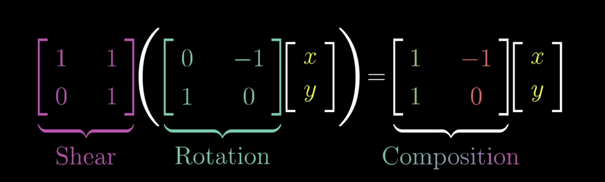
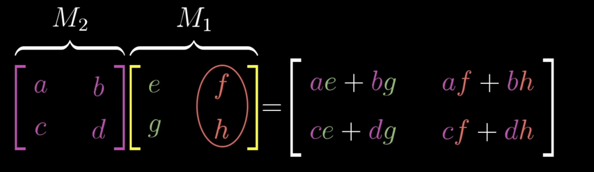
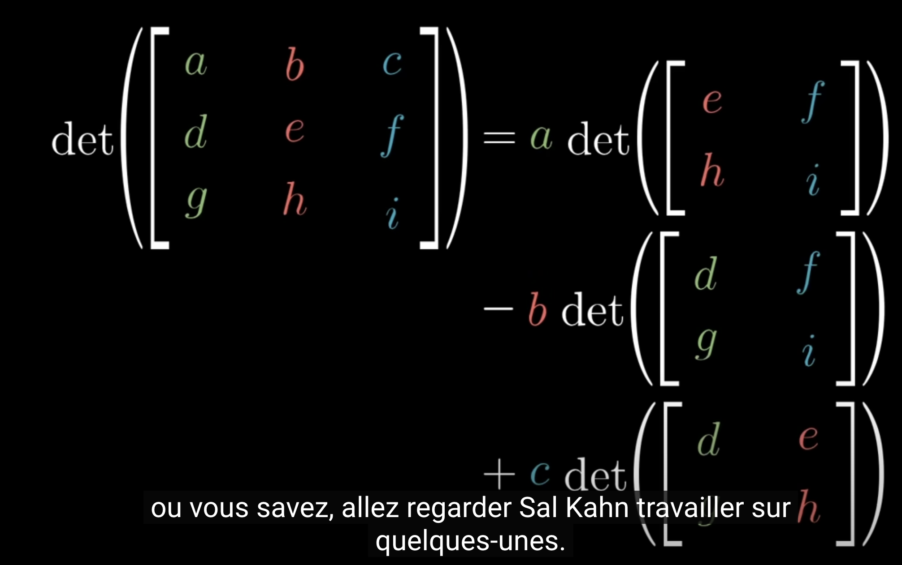
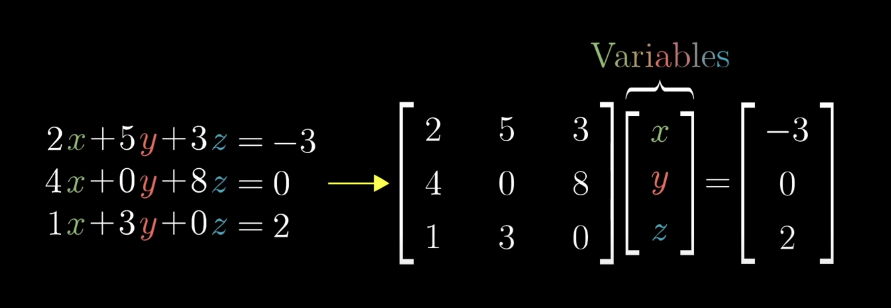

## Linear Algebra

## Video 1: basis of vectors

[Video Link](https://www.youtube.com/watch?v=fNk_zzaMoSs&list=PLZHQObOWTQDPD3MizzM2xVFitgF8hE_ab)

 - Vector helps you organize number
 - Adding two vectors is like putting them together in one single line

## Video 2: Linear Combination Spans and Vector Space

[Video Link](https://www.youtube.com/watch?v=k7RM-ot2NWY&list=PLZHQObOWTQDPD3MizzM2xVFitgF8hE_ab)

 - î = unit vector on the x axis
 - Ĵ = unit vector on the y axis
 - ($\hat{i}$, $\hat{j}$) are the basic of the coordinates system
 - think of the coordinates of a vector as scalars
   - the vector [3, -2] is in fact [3 * $\hat{i}$, -2 * $\hat{j}$]
 - Linear combination of vectors: $a * \vec{v} + b * \vec{w}$
   - $a$ and $b$ are two scalars 
   - the span of $\vec{v}$ and $\vec{w}$ is the combination of all their linear combination. In other words, all the potential vectors $a * \vec{v} + b * \vec{w}$
 - the basis of a vector space is a set of linearly independent vectors that span the full space

## Video 3: Linear Transformations and Matrices

[Video Link](https://www.youtube.com/watch?v=kYB8IZa5AuE&list=PLZHQObOWTQDPD3MizzM2xVFitgF8hE_ab&index=3)

 - linear transformation is a function that takes a vector as input and produces a vector as output
 
 

Potential functions to apply

 - rotation: rotate the plan
 - shear: stretch the plan

 

  

## Video 5: Three-Dimensions Linear Transformation

 - works smilar as a 2-D matrix
 - when applying transformation, always start with the transformation from the right

## Video 6: Determinant

 [Video Link](https://www.youtube.com/watch?v=Ip3X9LOh2dk&list=PLZHQObOWTQDPD3MizzM2xVFitgF8hE_ab&index=6)

 - the determinant is the scaling factor
 - if the determinant is 0, is means that is squishes the matrix into a single dimension
 - negative determinant means flipping the space, it inverts the orientation of space

 How to compute determinant

## Video 7: Inverse Matrices, Column Space and Null Space

[Video Link](https://www.youtube.com/watch?v=uQhTuRlWMxw&list=PLZHQObOWTQDPD3MizzM2xVFitgF8hE_ab&index=7)

You can map an equation into a matrix

 - $A^{-1} * A = (identity matrix)$
 - there is no inverse matrix if the determinant is 0
 - the rank is the number of dimensions in the output of a transformation
   - if all points are on a line after a transformation, it is said to be rank 1
   - matrix is full rank if the rank is equal to the number of columns
 - set of vectors that sets on the origin form the "null space" - the "kernel" of the matrix

## Video 8: Nonsquare matrices as transformations between dimensions

[Video Link](https://www.youtube.com/watch?v=v8VSDg_WQlA&list=PLZHQObOWTQDPD3MizzM2xVFitgF8hE_ab&index=8)

A 3x2 matrix is used to transform a 2-D space into a 3-D space.